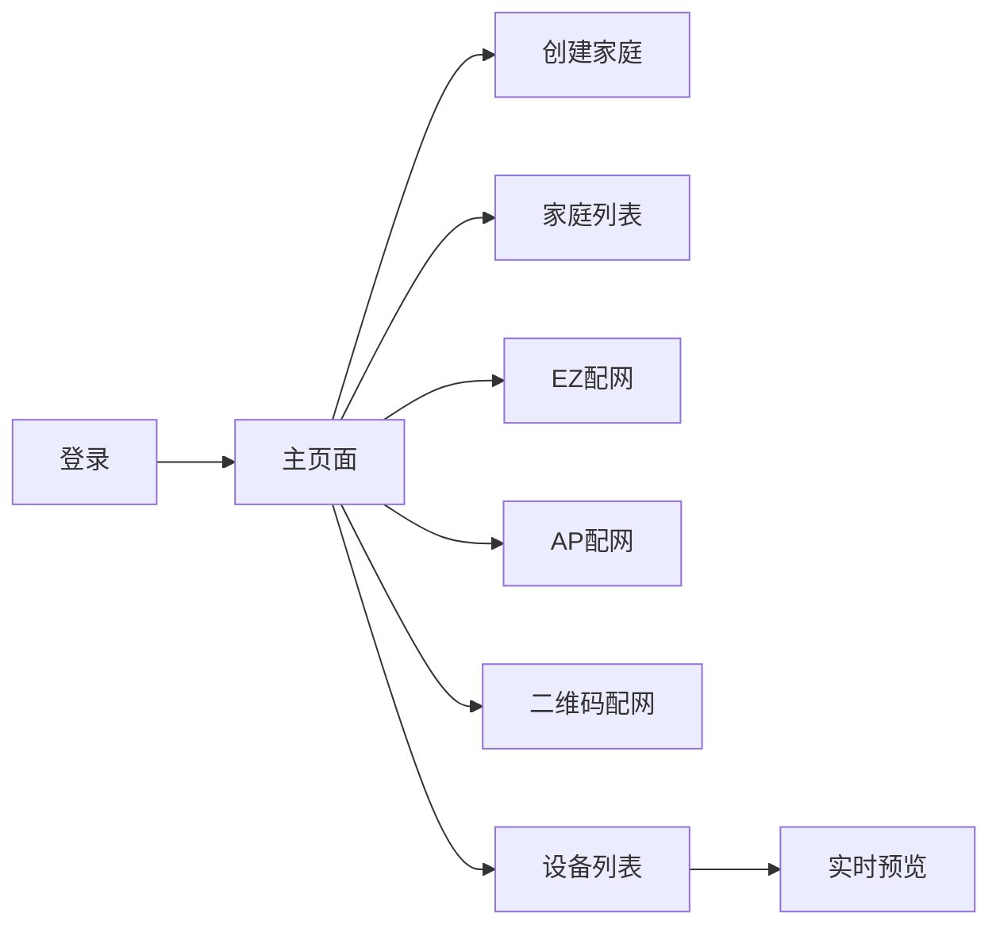

# IPC Demo · 操作文档

> 与当前仓库代码同步。集成细节见：[IPC_SDK_集成文档.md](./IPC_SDK_集成文档.md)  
> 仓库：https://github.com/liuhepan-web/IPCDemo

---

## 1. 运行前准备

1. Android Studio 打开工程根目录 `IPCDemo`。
2. `app/libs/` 放入平台下发的 **安全算法包** AAR。
3. IoT 平台 App 包名设为 `com.ipc.demo.set`，并绑定当前调试证书 **SHA256**。
4. 配置 `local.properties`（勿提交）：

```bash
cp local.properties.example local.properties
```

```properties
sdk.dir=/path/to/Android/sdk
appKey=你的_AppKey
appSecret=你的_AppSecret
```

5. 真机调试（ABI：`armeabi-v7a` / `arm64-v8a`）；模拟器难以完整验证 P2P。
6. 运行 Debug，启动页为 **登录**；应用名显示为 **IPC Demo**。

---

## 2. 整体流程

```text
登录 / 注册
  → 控制台（主页面）
      ├─ 创建 / 选择家庭
      ├─ EZ / AP / 摄像头二维码 配网
      └─ 设备列表 → 点击摄像机
            → 实时预览面板
                ├─ 预览控制：对讲 / 截图 / 录像 / 静音 / 清晰度 / 视频通话*
                ├─ 双指缩放 / 双击放大 · 横屏全屏
                ├─ 设备功能：云台* · 存储卡 · 卡录像 · 本地相册 · 消息
                └─ 云存储* / 增值服务*（仅支持云存储时显示）
```

`*` 表示按设备能力显隐。

---

## 3. 界面总览（UI 示例）

配色：背景 `#EEF2F5`，顶栏 `#1B2E3A`，主色 `#1F6F8B`，强调色 `#D97706`。

### 3.1 登录页

布局：`activity_login.xml` · 类：`LoginActivity`

```text
┌─────────────────────────────────────┐
│ ████  (顶栏深色)                      │
│ IPC Demo                             │
│ Smart Life · IPC 演示                 │
├─────────────────────────────────────┤
│  ┌─ 白底卡片 ─────────────────────┐  │
│  │ 账号                            │  │
│  │ 登录                            │  │
│  │ [国家码 86      ]                │  │
│  │ [账号（手机/邮箱）]              │  │
│  │ [密码           ]                │  │
│  │ [        登 录        ]           │  │
│  │     去注册 →                     │  │
│  └─────────────────────────────────┘  │
└─────────────────────────────────────┘
```

| 步骤 | 操作 |
|------|------|
| 登录 | 国家码 + 账号 + 密码 → **登录** |
| 注册 | 进入注册页 → 获取验证码 → 完成注册 |
| 已登录 | 再次打开会进入控制台 |

---

### 3.2 主页面（控制台）★

布局：`activity_main.xml` · 类：`MainActivity`

```text
┌─────────────────────────────────────┐
│ ████                                 │
│ IPC Demo                             │
│ 家庭 · 配网 · 设备准备                 │
├─────────────────────────────────────┤
│  ┌─ 家庭卡片 ─────────────────────┐  │
│  │ 家庭                            │  │
│  │ 当前：我的家 (123456789)         │  │
│  │ ───────────────────────────     │  │
│  │ 家庭列表                        │  │
│  │ 我的家 (123…)                   │  │
│  └─────────────────────────────────┘  │
│  ┌─ 操作卡片 ─────────────────────┐  │
│  │ [      创建家庭      ]             │  │
│  │ [      家庭列表      ]           │  │
│  │ [    刷新家庭列表    ]           │  │
│  │ [      EZ 配网       ]           │  │
│  │ [      AP 配网       ]           │  │
│  │ [  摄像头二维码配网  ]           │  │
│  │ [      设备列表      ]           │  │
│  │ [      退出登录      ]           │  │
│  └─────────────────────────────────┘  │
└─────────────────────────────────────┘
```

| 按钮 | 作用 |
|------|------|
| 创建家庭 | 创建后作为当前家庭 |
| 家庭列表 | 切换当前家庭 |
| 刷新家庭列表 | 重新拉取家庭数据 |
| EZ / AP / 摄像头二维码配网 | 三种配网方式 |
| 设备列表 | 当前家庭设备（需已选家庭） |
| 退出登录 | 回登录页 |



---

### 3.3 设备列表

类：`DeviceListActivity`

| 操作 | 说明 |
|------|------|
| 点击 IPC | 进入实时预览 |
| 点击非 IPC | 提示无法打开预览 |
| **长按** | 确认后从家庭移除设备 |

---

### 3.4 实时预览面板（核心）

布局：`activity_camera_panel.xml` · 类：`CameraPanelActivity`

```text
┌─────────────────────────────────────┐
│ ←  实时预览                    [全屏] │
├─────────────────────────────────────┤
│ ┌─ 预览区 16:9 ───────────────────┐ │
│ │ 预览中                             │ │
│ │         （视频画面）               │ │
│ │                双指缩放 / 双击放大 │ │
│ └───────────────────────────────────┘ │
│ 预览控制                              │
│ [ 语音对讲 ] [ 截图 ] [ 录像 ]        │
│ [开启声音] [高清] [视频通话*]         │
│ 设备功能                              │
│ [云台*] [存储卡] [卡录像]             │
│ [本地相册] [消息] [云存储*] [VAS*]    │
└─────────────────────────────────────┘
```

#### 预览手势

| 手势 | 效果 |
|------|------|
| 双指捏合 | 连续缩放约 1×～4× |
| 双击画面 | 放大 / 还原（`ThingCameraView` 默认支持双击缩放；Demo 亦有双击切换逻辑） |

#### 预览控制

| 按钮 | 说明 |
|------|------|
| 静音 / 开启声音 | 预览音频 |
| 高清 / 标清 | 清晰度 |
| 语音对讲 | 需麦克风权限 |
| 视频通话 | 设备支持时显示 |
| 截图 | 存至应用私有目录；Toast 提示去「本地相册」 |
| 录像 | 本地 MP4；停止后可在「本地相册」查看 |
| 全屏 | 横屏全屏预览 |

截图/录像路径：

```text
Android/data/com.ipc.demo.set/files/<设备ID>/
```

#### 设备功能入口

| 入口 | 说明 | 显示条件 |
|------|------|----------|
| 云台 | 上/下/左/右 | 支持 PTZ DP |
| 存储卡 | 状态、格式化、卡录像开关等 | 有相关 DP |
| 卡录像 | SD 回放 + 时间轴 | 常显 |
| 本地相册 | 截图/本地录像浏览 | 常显 |
| 消息 | 当天告警消息 | 常显 |
| 云存储 / 增值服务 | 云录像 / VAS | `isSupportCloudStorage == true` |

#### 横屏全屏

- 顶栏与竖屏功能区隐藏；左上角黑色返回或系统返回退出全屏。
- 底部操作条：静音 / 清晰度 / 对讲 / 截图 / 录像。

---

### 3.5 摄像头二维码配网

类：`DeviceConfigQrActivity`

1. 主页面 → **摄像头二维码配网**（需已选家庭）。
2. 填写 2.4GHz Wi-Fi → 生成二维码。
3. 二维码正对摄像机（约 15–20cm）扫描。
4. 成功后到设备列表查看。

---

### 3.6 本地相册

类：`CameraAlbumActivity`

- 网格展示本设备 jpg / mp4；点击可全屏看图或播录像。
- 页顶显示保存目录路径。

---

## 4. EZ / AP 配网

### EZ

主页面 → EZ 配网 → 填 Wi-Fi → 设备进配网模式 → 开始配网。

### AP

主页面 → AP 配网 → 填路由 Wi-Fi → 连接设备热点（如 `SmartLife-XXXX`）→ 回 App 激活。

---

## 5. 存储卡 / 卡录像 / 消息 / 云存储

| 功能 | 路径 | 说明 |
|------|------|------|
| 存储卡 | 预览 → 存储卡 | 状态、容量、格式化、卡录像开关、水印 |
| 卡录像 | 预览 → 卡录像 | 进页前异步释放预览 P2P；时间轴播放；时间轴进度约每 400ms 刷新（避免 ANR） |
| 消息 | 预览 → 消息 | 当天告警；加密图；长按可删 |
| 云存储 / VAS | 预览对应入口 | 仅支持云存储的设备可见 |

卡回放常见错误：`-40201`（会话/参数）、`-40205`（该点无录像）。

---

## 6. 门铃呼叫

设备支持时，来电拉起接听 / 拒接 / 挂断界面（`CameraDoorBellActivity`）。

---

## 7. 推荐验收清单

- [ ] 登录并创建/选择家庭  
- [ ] EZ / AP / 二维码配网至少一种成功  
- [ ] 设备列表可见；长按可移除  
- [ ] IPC 预览有画面；双指缩放、双击放大  
- [ ] 声音、清晰度、对讲  
- [ ] 截图、本地录像 → 本地相册可查看  
- [ ] 横屏全屏可用  
- [ ] 不支持云存储则看不到云入口  
- [ ] 卡录像 / 消息可打开  

---

## 8. 操作注意

1. 预览依赖公网与 P2P。  
2. 对讲需麦克风；配网常需定位。  
3. 进卡录像/云存储前 Demo 会释放预览连接。  
4. 截图在 App 私有目录，不在系统相册。  
5. 包名、SHA256、AppKey 须与 IoT 平台一致。

---

## 9. 界面与代码对照

| 界面 | 布局 / 类 |
|------|-----------|
| 登录 | `activity_login.xml` / `LoginActivity` |
| 主页面 | `activity_main.xml` / `MainActivity` |
| 二维码配网 | `DeviceConfigQrActivity` |
| 设备列表 | `DeviceListActivity` |
| 实时预览 | `CameraPanelActivity` |
| 本地相册 | `CameraAlbumActivity` |
| 双指 / 双击缩放 | `setupZoom()`；SDK 默认双击见 `setCameraViewDoubleClickEnable` |
| 云存储显隐 | `isSupportCloudStorage(devId)` |

更完整的 API 见集成文档。
